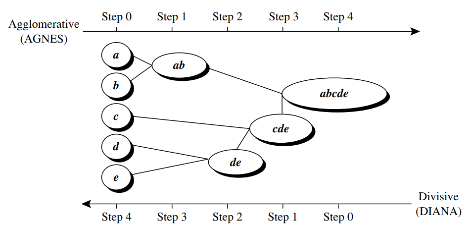

# Metode Clustering

***Clustering*** memiliki 4 metode yaitu *Partitioning methods*, *Hierarchical methods*, *Density-based methods*, dan *Grid-based methods*. Dalam hal ini yang dijelaskan adalah metode *Partitioning methods* dan *Hierarchical methods*.

## Partitioning Methods
Menurut (Han dkk., 2012) ***Partitioning methods*** adalah suatu metode yang mempartisi data menjadi $k$ partisi, setiap partisi mewakili suatu kelompok dengan $k \leq n$. ***Partitioning methods*** membagi data ke dalam k partisi sehingga masing-masing partisi memiliki minimal satu objek, atau dengan kata lain setiap objek tepat memiliki satu kelompok (Han dkk., 2012).  ***Partitioning methods*** memiliki beberapa algoritma yaitu *k-means* dan *k-medoids*.

## Hierarchical Methods
***Hierarchical methods*** mengelompokan objek data menjadi struktur berupa hierarki atau pohon (Han dkk., 2012). Pengelompokan hierarki dapat bersifat *agglomerative* (pemusatan) dan *divise* (penyebaran).

Pengelompokan dengan sifat *agglomerative* setiap objek dianggap sebuah *cluster* dan secara berulang menggabungkan *cluster* menjadi *cluster* yang lebih besar hingga semua objek menjadi satu *cluster*. Penggabungan suatu *cluster* dengan *cluster* lain didasarkan pada jarak dua *cluster* tersebut. Sebaliknya, *divise* dimulai dengan menempatkan semua objek dalam satu *cluster* yang menjadi akar hierarki. Kemudian membagi *cluster* menjadi *subcluster* yang lebih kecil, dan proses terus berlanjut secara berulang menjadi yang lebih kecil lagi. Algoritma ***Hierarchical methods*** diantaranya *Single Linkage, Complete Linkage, Average Linkage*, dan *Average Linkage Group*.