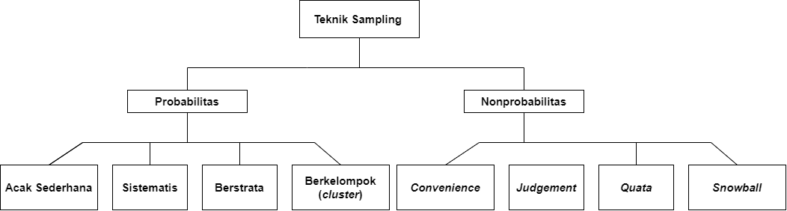

# Apa itu Sampling??

Dalam ilmu statistika, ketika melakukan penarikan kesimpulan pada suatu masalah dimana data yang digunakan cukup besar maka perlu memanfaatkan sampel yang merupakan bagian populasi. Populasi itu sendiri adalah keseluruh data yang ingin diteliti. Dalam pengambilan sampel maka diperlukan yang namanya teknik pengambilan sampel yang biasa dikenal dengan *teknik sampling*. ***Sampling*** adalah proses yang dilakukan untuk memilih sampel dari suatu populasi sehingga sampel yang diperoleh mewakili populasi yang ada (Dr. Eng. Yeri Sutopo dkk., t.t.). Pada Gambar dibawah merupakan metode penarikan sampel.

Teknik *Sampling* dibagi menjadi dua bagian secara garis besar yaitu *Probability sampling* dan *Nonprobability sampling*.

## Probability sampling
*Probability sampling* adalah teknik eknik pengambilan sampel yang memberikan peluang yang sama untuk setiap anggota populasi untuk dipilih sebagai sampel. *Probability sampling* diantaranya *Simple Random Sampling, Systematic Random Sampling, Stratified Random Sampling*, dan *Cluster Sampling*.

## Nonprobability sampling
*Nonprobability sampling* adalah teknik pengambilan sampel yang tidak memberikan peluang yang sama untuk setiap unsur (anggota) populasi untuk dipilih sebagai sampel. *Nonprobability sampling* diantaranya *Convenience, Judgment, Quota*, dan *Snowball*.