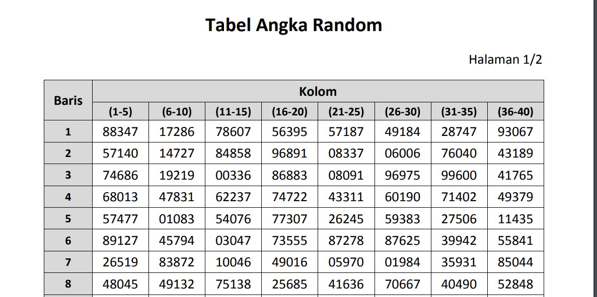

# Simple Random Sampling
***Simple Random Sampling*** merupakan salah satu metode pengambilan sampel yang memberi kesempatan yang sama kesetiap unsur pada populasi. Jika sampel ukuran $n$ diambil dari populasi yang berukuran $N$ sedemikian sehingga setiap kemungkinan sampel ukuran $n$ memiliki peluang yang sama untuk dipilih, maka prosedur pengambilan sampel disebut ***Simple Random Sampling*** (Scheafer dkk., 2017). Pengambilan sampel dengan teknik ini, dapat memanfaatkan tabel bilangan acak atau dengan sistem undian. Dibawah ini merupakan gambar tabel bilangan acak (sebagian). Secara lengkap tabel bilangan acak dapat dilihat pada link berikut [tabel bilangan acak](https://jagostat.com/files/Tabel%20Angka%20Random.pdf)



Dalam membangun aplikasi **Prediksi Dampak Gempa** pembuat website menggunakan sistem undian dengan memanfaatkan fungsi bawaan *Javascript* yaitu `Math.random()`. Fungsi tersebut mengembalikan bilangan real acak lebih besar atau sama dengan 0 dan kurang dari 1. Jika ingin memperoleh bilangan acak sebutlah lebih besar sama atau sama dengan a dan kurang dari b fungsi `Math.random()` dimodifikasi seperti *code* dibawah ini
```javascript
1. Math.random() // Mengembalikan 0<=nilai<1 
2. Math.floor(Math.random() * (b)) + a // Mengembalikan a<=nilai<b
```