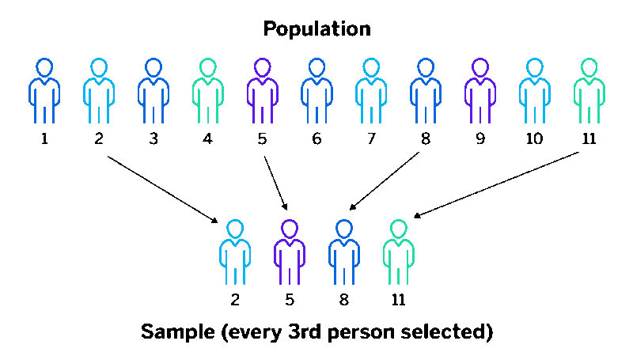

# Systematic Random Sampling

***Systematic Random Sampling*** merupakan metode pengambilan sampel (sampling) yang memilih secara acak satu unsur pertama dari k unsur sebagai sampel awal, kemudian dilanjutkan dengan mengambil sampel secara sistematis sampai n buah sampel diperoleh dari N populasi (Scheafer dkk., 2017).

Berikut langkah-langkah pengambilan sampel menggunakan ***Systematic Random Sampling***
1.	Menentukan banyak sampel $n$
2.	Menentukan nilai $k=\frac{N}{n}$
3.	Memilih secara acak sampel awal dari $k$ unsur pertama
4. Memilih sampel selanjutnya dengan pola sistematis (kelipatan $k$) sampai memperoleh $n$ buah sampel dari $N$ (ukuran populasi)

Pada langkah ketiga dapat memanfaatkan ***[Simple Random Sampling](../teorisampling/simplerandomsampling.md)*** yang sudah dijelaskan sebelumnya. Penulis membuat fungsi sendiri dalam pengambilan sampel menggunakan ***Systematic Random Sampling***. Jika pembaca ingin *code* lengkapnya nya dapat menghubungi [penulis](/aboutme)
