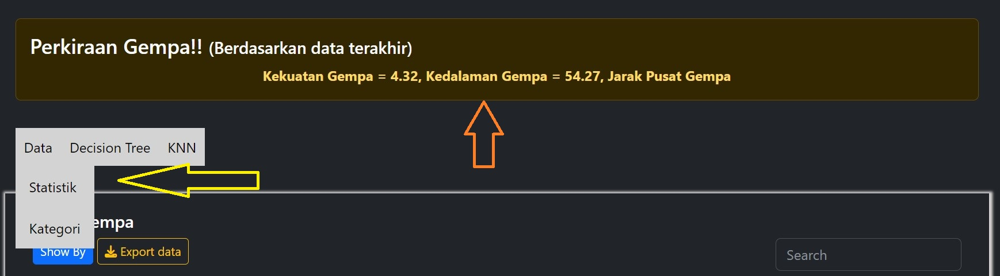

# Navigasi Aplikasi

Aplikasi ini menggunakan navigasi yang membantu pengguna mengunjungi seluruh content yang ada di website.



Pada gambar diatas (panah berwarna orange), pengguna dapat melihat perkiraan gempa yang terjadi berdasarkan data terakhir dari BMKG. Pengguna dapat mengklik bagian navigasi yang ditunjukan panah berwarna kuning. Setelah mengklik navigasi maka pengguna akan di arahkan ke halaman yang diinginkan.

Navigasi ini terdiri dari berikut:

```code
1. Statistik
2. Kategori
3. Prediksi (Decision Tree)
4. Tabel (Decision Tree)
5. Evaluasi (Split Validation)
6. Evaluasi (k-fold Cross Validation)
7. Performa (Split Validation)
8. Performa (k-fold Cross Validation)
```
