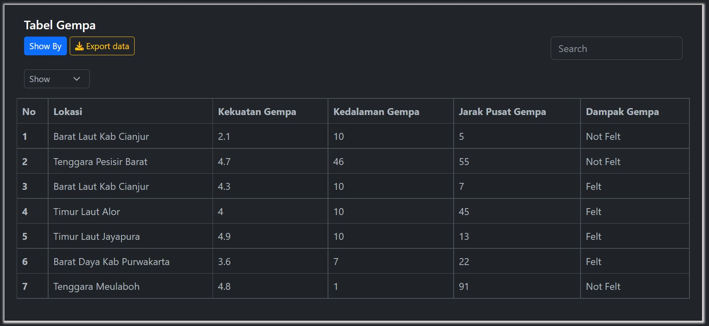
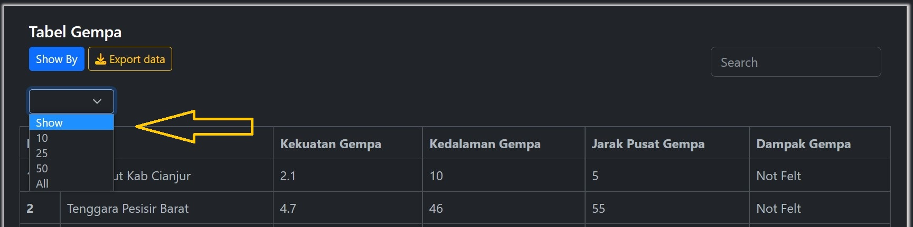
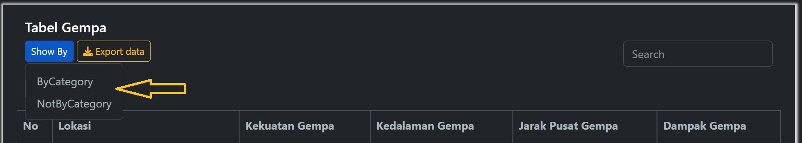
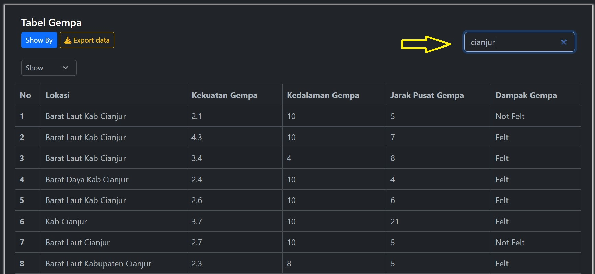

# Tampilan Tabel

Pada aplikasi prediksi dampak gempa, pengguna dapat melihat data gempa dalam bentuk tabel. Berikut tampilan tabel dengan 7 data gempa.

Secara default pengguna melihat 7 data gempa. Jika ingin melihat data gempa secara lengkap atau melihat data sebanyak 10, 25, atau 50, penggguna dapat mengklik dropdown `show` kemudian memilih banyak data yang ingin ditampilkan.

 

Pengguna juga dapat melihat data secara kategori dengan mengklik dropdown `Show By` kemudian memilih `ByCategory`. Jika pengguna ingin melihat kembali data aslinya, pengguna dapat memilih `NotByCategory`.

 

Jika Pengguna ingin mengunduh data maka dapat mengklik dropdown `Export data` kemudian memilih mengunduh data sebagai data kategori atau tidak. Format file yang diunduh berupa format file `.csv`.

Pengguna dapat mencari lokasi data gempa dengan mengetikan di kolom inputan `Search`. Setelah mengetikan lokasi maka data gempa akan muncul sesuai kata kunci yang diberikan. Pada gambar dibawah contoh ketika mengetikan lokasi gempa di **Cianjur** maka data yang kelihatan di tabel adalah data gempa yang terjadi di **Cianjur**.

