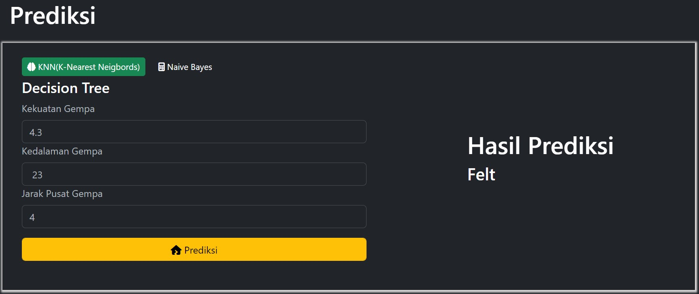
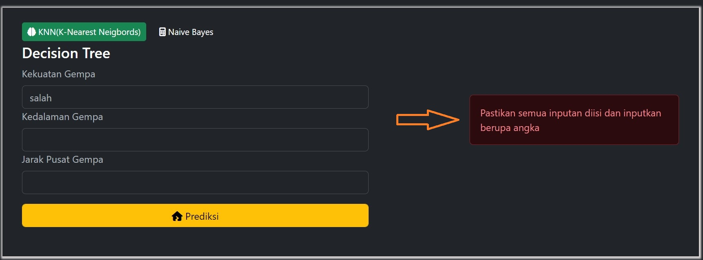

# Prediksi

Pada halaman prediksi, pengguna dapat memprediksi dampak gempa dengan menginputkan `kekuatan gempa`, `kedalaman gempa`, dan `jarak pusat gempa` pada inputan yang sudah disediakan.

Seperti gambar diatas, jika diinputkan kekuatan gempa sebesar 4.3, kedalaman gempa 23 dan jarak pusat gempa sebesar 4 diperoleh prediksi dampak gempa `Felt`. Jika user menginputkan dengan format bukan angka atau salah satu kolom inputan kosong maka pesan error akan muncul seperti gambar dibawah ini.

