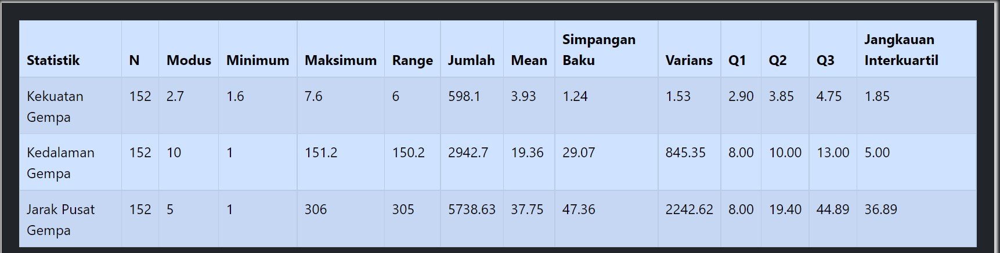
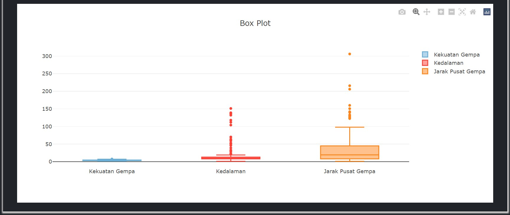
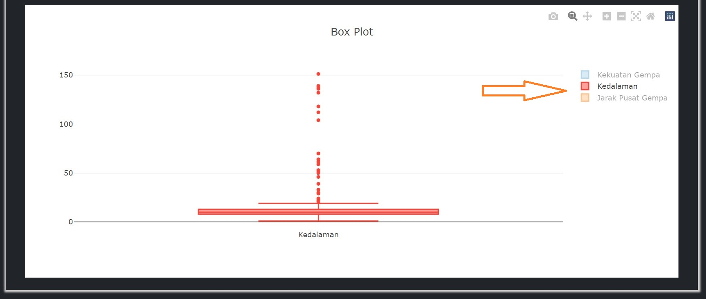

# Statistik Data Gempa

Pada halaman ini pengguna dapat melihat statistik data gempa berupa tabel. Berikut tampilan statistik data gempa.

Pada gambar diatas, terlihat statistik data gempa masing-masing faktor `kekuatan gempa`, `kedalaman gempa`, dan `jarak pusat gempa`. Statistik data berupa banyak data, modus, nilai minimum, nilai maksimum, range, jumlah, mean, simpangan baku, varians, Q1, Q2, Q3, dan jangkauan interkuartil.

Padar halaman tersebut, pengguna dapat melihat data menggunakan `boxplot`.

`Boxplot` juga bisa dilihat secara spesifik dengan mengklik dua kali pada label yang terletak di sebelah kanan.

