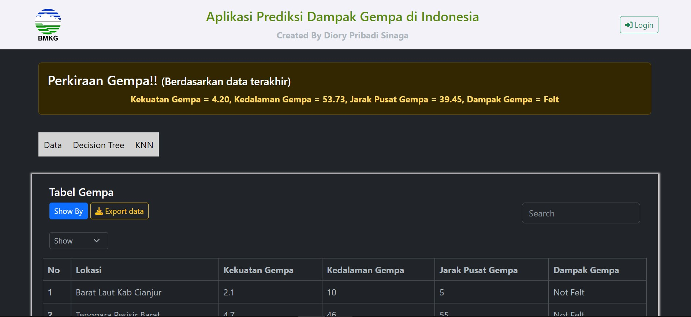
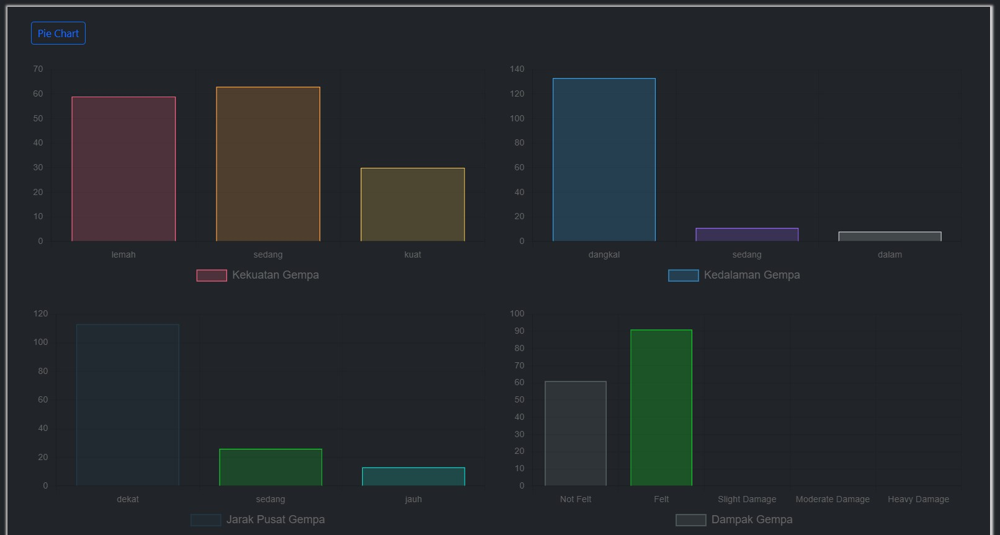
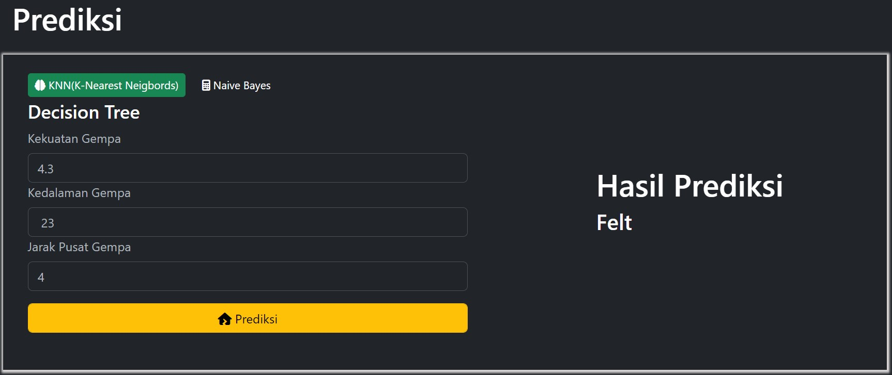

# About Website

Website ini dibuat guna menyelesaikan Tugas Akhir(Skripsi) [penulis](/aboutme) yang berjudul **"Aplikasi Web Prediksi Dampak Gempa di Indonesia Menggunakan Metode Decision Tree dengan Algoritma C4.5"**. Website ini tidak dapat diselesaikan tanpa bantuan pembimbing penulis. Dosen Pembimbing I **Hj. Rini Marwati, M.S** dan Dosen Pembimbing II **Dr. Bambang Avip Priatna, M.Si**.



Website ini dibangun menggunakan bahasa pemrograman [`javascript`](https://developer.mozilla.org/en-US/docs/Web/JavaScript) dan [`nodejs`](https://nodejs.org) sebagai runtime dan [`expressjs`](https://expressjs.com) web framework. Website ini juga dibangun menggunakan beberapa `package` yang dapat di install di [npm](https://www.npmjs.com). Berikut  `package` yang digunakan dalam membangun website ini:
```json
"dependencies": {
    "alea": "^1.0.1",
    "async-csv": "^2.1.3",
    "axios": "^1.3.5",
    "bcrypt": "^5.1.0",
    "body-parser": "^1.20.1",
    "cookie-parser": "^1.4.6",
    "csv": "^6.2.5",
    "dotenv": "^16.0.3",
    "ejs": "^3.1.8",
    "express": "^4.18.2",
    "json2csv": "^6.0.0-alpha.2",
    "jsonwebtoken": "^9.0.0",
    "markdown-it": "^13.0.1",
    "marked": "^4.2.12",
    "pg": "^8.8.0",
    "sequelize": "^6.28.0",
    "sequelize-cli": "^6.6.0",
    "simple-statistics": "^7.8.2",
    "validator": "^13.9.0"
}
```

Aplikasi Web ini dibuat dengan tujuan dapat digunakan oleh banyak orang untuk melakukan prediksi dampak gempa yang terjadi di Indonesia berdasarkan `kekuatan gempa`, `kedalaman gempa`, dan `jarak pusat gempa`. Dalam memprediksi dampak gempa, penulis menggunakan metode klasifikasi ***Decision Tree*** dengan algoritma **C4.5** dalam membangun pohon keputusan. Data yang diperoleh berupa data **numerik**. Pengguna aplikasi dapat melihat statistik data gempa yang diambil dari 24 Januari 2023 sampai 30 Maret 2023.


Karena data **numerik** penulis mengkategorikan menjadi beberapa kategori. Penulis menggunakan ***k-means Clustering*** dalam mengkategorikan data, dengan pengambilan sampel yang digunakan adalah  ***Simple Random Sampling*** dan  ***Systematic Random Sampling***.



Dalam memilih model `terbaik`, penulis menggunakan validasi model dengan ***Split Validation*** dan ***k-fold Cross Validation***. Pengguna dapat melihat performa model dan perbandingan performa masing-masing teknik validasi.


Model terbaik diperoleh pada iterasi pertama pada teknik ***10-fold Cross Validation***. Dari pemilihan model `terbaik` yang diperoleh, kemudian dipakai untuk melakukan prediksi dampak gempa. Contoh prediksi dampak gempa seperti dibawah ini dengan menginputkan kekuatan gempa sebesar 4.3 Magnitudo, kedalaman gempa sebesar 23 km, dan jarak pusat gempa sebesar 4 km diperoleh dampak gempa yang dirasakan adalah **Felt**.



Sekian sedikit penjelasan mengenai aplikasi web. Akhir kata penulis mengucapkan (baca code dibawah) **:)**

```javascript
1. console.log(Salam dari saya Diory Pribadi Sinaga Mahasiswa Universitas Pendidikan Indonesia)
2. for(let i=0 ; i<=Infinity ; i++){
3.     console.log(Terima Kasih)
4. }
```